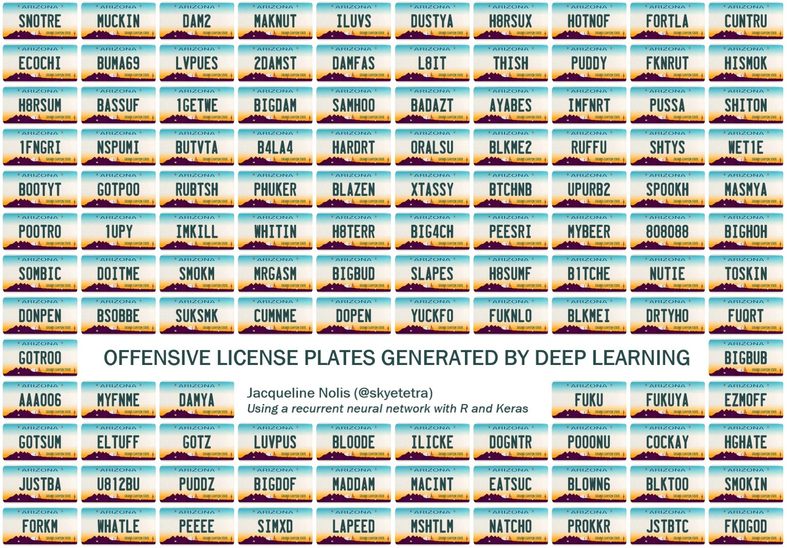

# Banned license plates generator



_2019-05-29: This code was refactored to reflect best practices and be in line with other models, such as the  [pet names](https://github.com/nolis-llc/pet-names) neural network._

This R code uses Keras to train a neural network on license plates that were banned by the Arizona Department of Transportation. It was my attempt at using neural networks to make something funny like the AI trained on [band names](https://twitter.com/botnikstudios/status/955870327652970496
), [video game titles](https://disexplications.tumblr.com/post/159165060164/video-game-titles-created-by-a-neural-network), and [pokemon](http://aiweirdness.com/post/147834883707/pokemon-generated-by-neural-network).

The code is based heavily on the RStudio [text generation example](https://keras.rstudio.com/articles/examples/lstm_text_generation.html).

The license plate corpus comes from a [google search](http://www.governmentattic.org/7docs/AZ-BannedPlates_2012.pdf) and is included in the repository, however I have a Public Records Request out for more recent data from the state.

The code is broken into three files:

  1. __train_model.R__ - This script trains a neural network on the license plates.
  2. __runtime_functions.R__ - This script contains functions that let you use the model to generate license plates.
  3. __parameters.R__ - This script contains the parameters needed at both training and runtime

To run the code, first make sure your have keras and tensorflow installed on your computer. You can use the [Rstudio guide](https://keras.rstudio.com/) to do this. Run `train_model.R` to train a model (or use the one included in the repository). Then run `runtime_functions.R` to load the completed model, and use those functions to generate names.

__Train a model:__
```r
source("train_model.R") # (optional) train a new model
```

__Run a model:__
```r
source("runtime_functions.R") # load the completed model

# generate a single license plate
generate_result(model, character_lookup, max_length)
# [1] "CH3SXYR"

#generate many license plates
generate_many_results(20, model, character_lookup, max_length)
# [1] "MANTER9" "HITNHUT" "H8NSX"   "COX3XXX" "FUAACHO" "BAMF"    "B1TGUAN" "2DAMLOW" "4STRUT"  "C0MMAMP" "PASFTC"  "H8LTRS" 
# [13] "SUKFTC"  "LEESHOG" "GTONADE" "MRUIC69" "TUZHI"   "LUVBUNK" "TITEIL"  "HO4FIN" 
```

## Next steps

* If you want to make this model into a production grade API as a Docker container, check out the [generating pet names](https://github.com/nolis-llc/pet-names) repository.
* If you want to make an API and also have it be enterprise ready, check out the [open source repository by T-Mobile](https://github.com/tmobile/r-tensorflow-api).